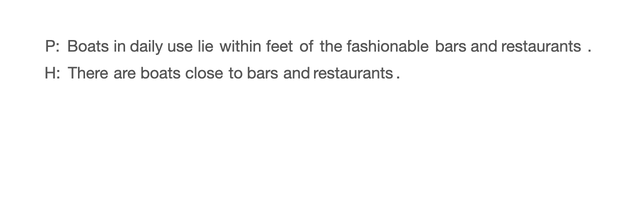

# Unnatural Language Understanding (UNLU)

This repository contains the code and data used in the paper "[_UnNatural Language Inference_](https://arxiv.org/abs/2101.00010)", to appear in ACL 2021 (Long paper).



[Demo Colab Notebook](https://colab.research.google.com/drive/1vv8Xmag1go3dib4vZXUZXAFB4ltDaMH7?usp=sharing)

# Getting Started

For reproducing our experiments, follow the outlined steps. We use Pytorch Model Hub checkpoints (trained using FairSeq) to infer RoBERTa and BART models. For DistilBERT, we train the model using code derived from ANLI repository. For pre-Transformer models, we train the models using InferSent repository.

## Install

1. Install [Pytorch 1.7.0](https://pytorch.org/get-started/previous-versions/#v170)

```sh
conda install pytorch==1.7.0 torchvision==0.8.0 -c pytorch
```

2. Install dependencies

```sh
pip install -r requirements.txt
pip install ray[tune]
```

and download the Spacy [English](https://spacy.io/models/en#en_core_web_md) and [Chinese](https://spacy.io/models/zh) Tokenizer:

```sh
python -m spacy download en_core_web_md
python -m spacy download zh_core_web_lg
```

**NB**: For training, please configure Apex on your system to enable fp16 training.

## Set Output Path

In `config.yaml`, first set the proper `outp_path` where you will download our files.

## Download the models

We provide a list of models used in the paper here. There are three model types: `Hub` for Pytorch Hub models, `HF` for trained HuggingFace models, and `RNN` for InferSent models. For Pytorch Hub models, you do not need to manually download the models as it is taken care by fairseq.

#### English language models trained on MNLI

|       Model        | Type | Size |                                   Location                                    |
| :----------------: | :--: | ---- | :---------------------------------------------------------------------------: |
| roberta.large.mnli | Hub  | -    |                                  Pytorch Hub                                  |
|  bart.large.mnli   | Hub  | -    |                                  Pytorch Hub                                  |
|  distilbert.mnli   |  HF  | 147M | [Download](https://dl.fbaipublicfiles.com/unlu/models/distilbert.mnli.tar.gz) |

#### Chinese language models trained on OCNLI corpus

|        Model        | Type | Size |                                     Location                                      |
| :-----------------: | :--: | ---- | :-------------------------------------------------------------------------------: |
| roberta.large.ocnli |  HF  | 729M | [Download](https://dl.fbaipublicfiles.com/unlu/models/roberta.large.ocnli.tar.gz) |

#### InferSent based models, trained on MNLI and OCNLI corpus

|         Model         | Type | Size |                                 Location                                 |
| :-------------------: | :--: | ---- | :----------------------------------------------------------------------: |
|    infersent.mnli     | RNN  | 1.1G | [Download](https://dl.fbaipublicfiles.com/unlu/models/rnn_models.tar.gz) |
|     convnet.mnli      | RNN  |      |                                                                          |
| blstmprojencoder.mnli | RNN  |      |                                                                          |

(Same location containing all folders and files)

#### Maximum Entropy Trained Models

|         Model         | Type | Size |                                      Location                                       |
| :-------------------: | :--: | ---- | :---------------------------------------------------------------------------------: |
| roberta.large.me.mnli |  HF  | 794M | [Download](https://dl.fbaipublicfiles.com/unlu/models/roberta.large.me.mnli.tar.gz) |

## Pre-requisites

Download and build the original [MNLI](https://cims.nyu.edu/~sbowman/multinli/), [SNLI](https://nlp.stanford.edu/projects/snli/), [ANLI](https://github.com/facebookresearch/anli) and [OCNLI](https://github.com/CLUEbenchmark/OCNLI) data following the code in [ANLI](anli/blob/dataset_tools/build_data.py), which places the data in `anli/build/{data name}`. You can use the following script to prepare the datasets in one go:

```bash
cd anli
source setup.sh
bash ./anli/script/download_data.sh
python src/dataset_tools/build_data.py
```

## Run Evaluation

We make use of Pytorch FairSeq, ANLI scripts and InferSent repository script for running evaluation on the word shuffled data and computing our metrics. Below we provide the steps to evaluate from each of these settings.

- In each of the datasets, the script first generates the word shuffled corpus and creates it at `{outp_path}/{eval_data}/rand_100_p_1.0_k_0.0_stop_False_punct_True/rand.jsonl`
- For each of the below cases, after the run evaluation is complete, you can view the outputs in `{outp_path}/{eval_data}/rand_100_p_1.0_k_0.0_stop_False_punct_True/outputs`

### Hub Evaluation

- Models: roberta.large.mnli, bart.large.mnli
- Run evaluation, where `eval_data` can be any one of Data names listed above. For example, to run evaluation on MNLI Matched development set, run:

  ```bash
  python main.py --eval_data mnli_m_dev --model_type hub --model_name roberta.large.mnli
  ```

  **Note** : You can modify the `batch_size` parameter in config.yaml to your liking for faster inference.

- You can use any [FairSeq](https://github.com/pytorch/fairseq) and [Pytorch Hub](https://pytorch.org/hub/) model trained on MNLI to explore similar setups.

### ANLI Evaluation

- Models: distilbert.mnli, roberta.large.ocnli
- Download the appropriate model from the above table and place it in `anli/models` folder
- For DistilBERT, run the following

  ```bash
  ./scripts/distilbert_eval.sh
  ```

- For OCNLI, run the following

  ```bash
  ./scripts/ocnli_eval.sh
  ```

- You can use any model trained using [HuggingFace Transformers](https://huggingface.co/transformers/) as done in [ANLI](https://github.com/facebookresearch/anli) repository in this section following the above scripts. To add your own model, add the path to your trained model in [`model_store`](anli/src/nli/evaluation.py#L36).

### InferSent Evaluation

- Models: infersent.mnli, convnet.mnli, bilstmproj.mnli
- Download the [appropriate model](https://dl.fbaipublicfiles.com/unlu/models/rnn_models.tar.gz) from the table above and extract in the root folder (you should have `rnn_models`) in the main folder
- For InferSent evaluation, we need a slightly different format of the data. For MNLI and OCNLI, we provide `run.sh` in `dataset_utils/mnli/` and `dataset_utils/ocnli` to convert the files appropriately. These scripts require `rnn_models` to exist in the main folder.
- Run evaluation, where `eval_data` can be any one of Data names listed above. For example, to run evaluation on MNLI Matched development set using InferSent model, run:

  ```bash
  python main.py --eval_data mnli_m_dev --model_type rnn_infersent --model_name infersent.mnli
  ```

- Model types are defined in `config.yaml`
- Example script to run other models is available in [scripts/transformer_eval.sh](scripts/transformer_eval.sh)

### Compute Table

You can use the table script to generate the aggregate table as in the paper:

```sh
python codes/tables.py --data_loc <outp_path> python --datas mnli_m_dev --models roberta.large.mnli
```

- For more rows in the table, provide the eval_data in comma separated way in `--datas` and provide the models in `--models` in a comma separated way. Check the defaults in `codes/tables.py` for more information.

### Compute Plots

You can use the plotting script to generate the plots used in the paper.

```sh
python codes/plot.py --plot entropy
```

## POS Tree Analysis

To run the POS Tree Analysis experiments, run the following script, which first computes the train statistic on MNLI train data and then computes the POS Tree analysis on model outputs.

```sh
python codes/min_tree.py -k 4 --loc data/ --compute_train_stats --mp
```

If you have already computed the train statistics (output file in `data/mnli_m_dev/min_tree_train.pkl`), omit the --compute_train_stats flag.

## Results

For reproducibility, you can check your results with our [published results](results.md) in the paper.

## Citation

If you find our work useful in your research, please cite us using the following bibtex.

```bibtex
@article{sinha2021unnat,
  title           = {{UnNatural Language Inference}},
  author          = {Koustuv Sinha and Prasanna Parthasarathi and Joelle Pineau
                  and Adina Williams},
  journal         = {ACL},
  year            = 2021,
  url             = {https://arxiv.org/abs/2101.00010},
  arxiv           = {2101.00010},
}
```

## Acknowledgement

- We thank the amazing [ANLI repository](https://github.com/facebookresearch/anli), which we use for various prototyping and experiments.
- We also use the [InferSent](https://github.com/facebookresearch/InferSent) repository for non-Transformer experiments

## License

UNLU is licensed under Creative Commons-Non Commercial 4.0. See the LICENSE file for more details.
